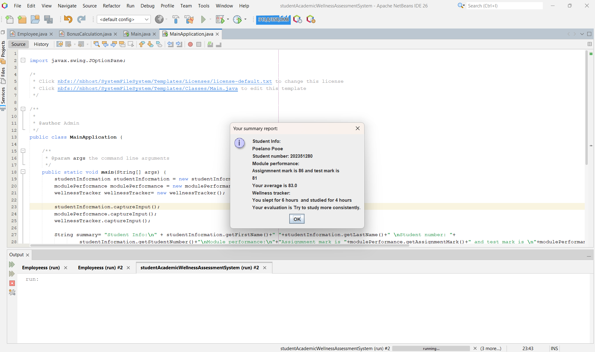

# LanoCode Project

## Description
This is a Java project developed using NetBeans IDE.

## Features
- GUI functionality
- Event handling
- Object-oriented programming concepts

## Technologies Used
- Java
- NetBeans IDE

## Application Preview

## How to Run

1. Clone or download the repository
2. Open the project in NetBeans
3. Build and Run the project
4. Interact with the buttons to see event handling in action

## Author
Poelano Chwayita Pooe
